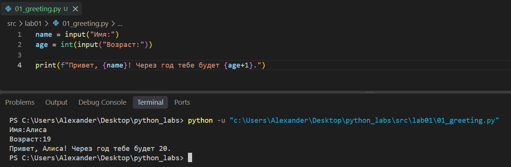
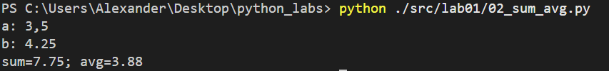
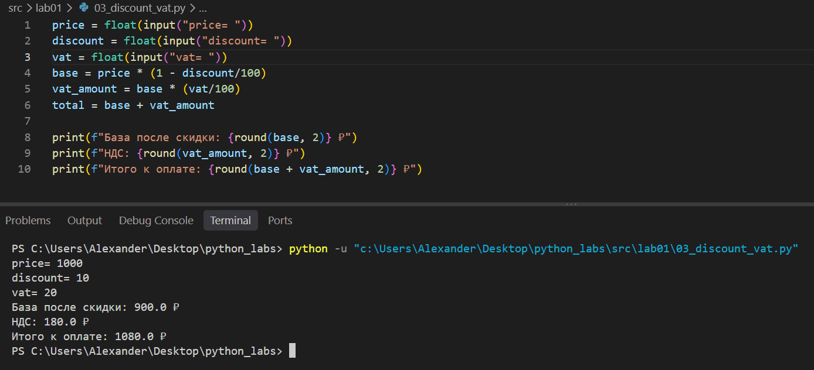
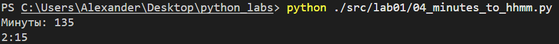
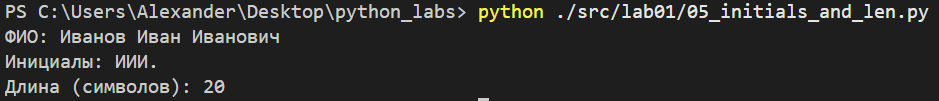
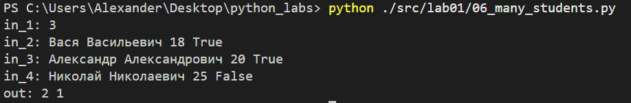

# ЛР1 — Ввод/вывод и форматирование

## Задание 1

## Задание 2
заменяем возможные запятые на точки для нормальной работы кода

## Задание 3

## Задание 4

## Задание 5
с помощью split() убираем все возможные пробелы и получаем список только с фамилией, именем и отчеством по отдельности
инициализируем len2 = 2 как количество пробелов между тремя словами в правильной строке

## Задание 6
заводим 2 счетчика, считываем n строк и закидываем 4 элемента в список
обращаемся к последнему элементу и в зависимости от True/False увеличиваем
один из счётчиков на 1

