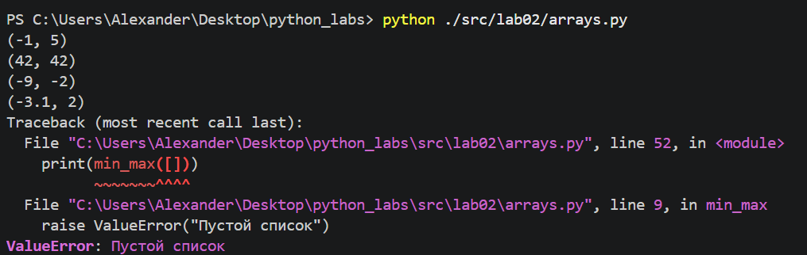
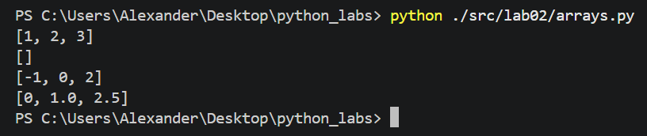
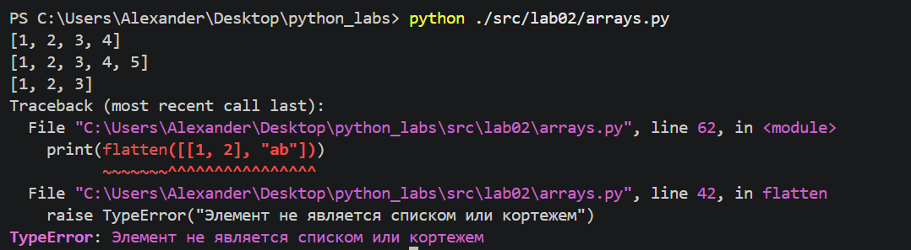
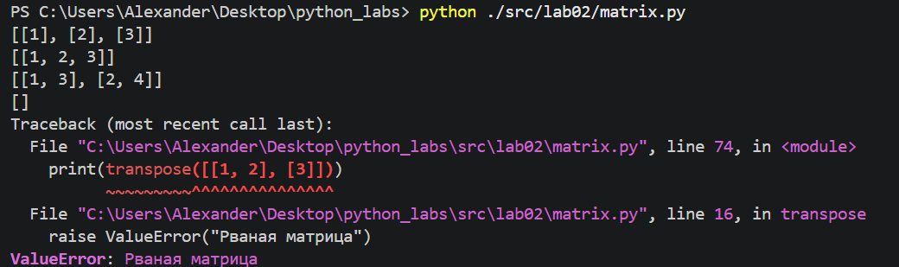
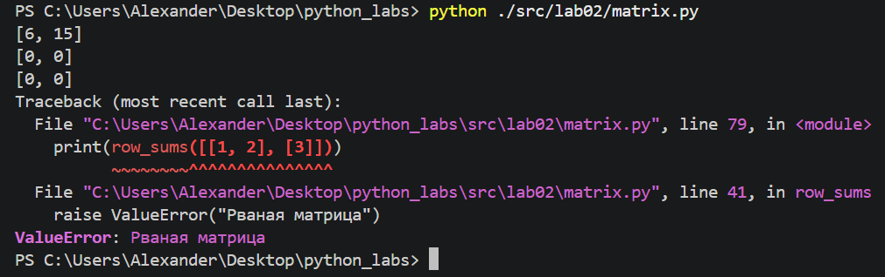
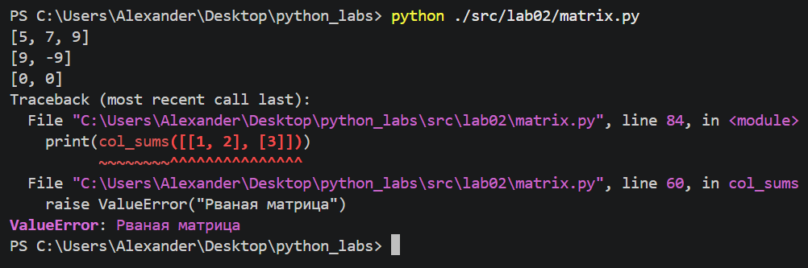
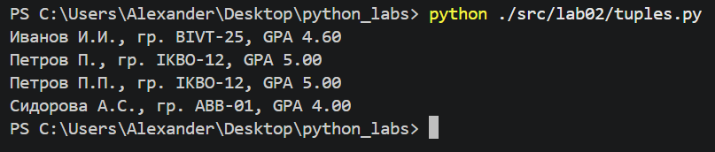

# ЛР2 — Коллекции и матрицы (list/tuple/set/dict)

## Задание 1 - arrays.py
### min_max
```python
def min_max(nums: list[float | int]) -> tuple[float | int, float | int]:
    """
    На вход подаётся список nums из вещественных или целых чисел,
    функция возвращает кортеж из наименьшего и наибольшего чисел из
    входного списка nums.
    Если список пустой, то вернётся ValueError.
    """
    if len(nums) == 0:
        raise ValueError("Пустой список")
    lowest = nums[0]
    biggest = nums[0]
    for num in nums:
        if num > biggest:
            biggest = num
        if num < lowest:
            lowest = num
    return (lowest, biggest)
```




### unique_sorted
```python
def unique_sorted(nums: list[float | int]) -> list[float | int]:
    """
    На вход подаётся список nums из вещественных или целых чисел,
    функция возвращает отсортированный список уникальных чисел в порядке возрастания.
    """
    unique_nums = list(set(nums))
    n = len(unique_nums)
    for i in range(n):
        for j in range(n-i-1):
            if unique_nums[j] > unique_nums[j+1]:
                unique_nums[j], unique_nums[j+1] = unique_nums[j+1], unique_nums[j]
    return unique_nums
```




### flatten
```python
def flatten(mat: list[list | tuple]) -> list:
    """
    На вход подаётся список из списков или кортежей mat,
    функция возвращает список, содержащий элементы всех входных списков или кортежей.
    В возвращённом списке элементы расположены в той же последовательности, в которой были переданы в функцию.
    Если какой-либо элемент не является списком или кортежем, то возвращается TypeError.
    """
    check = all([type(i) is tuple or type(i) is list for i in mat])
    if not check:
        raise TypeError("Элемент не является списком или кортежем")
    new_list = []
    for i in mat:
        new_list.extend(i)
    return new_list
```




## Задание 2 - matrix.py
### transpose
```python
def transpose(mat: list[list[float | int]]) -> list[list]:
    """
    На вход подаётся матрица размера m*n,
    где m - число строк, n - число столбцов.
    Возвращается матрица размера n*m,
    т.е. строки и столбцы меняются местами.
    Для пустой матрицы: [] -> [].
    Если строки в матрице разной длины(рваная матрица), то
    вернется ValueError.
    """
    if mat == []:
        return []
    
    for row in mat:
        if len(row) != len(mat[0]):
            raise ValueError("Рваная матрица")

    rows = len(mat)
    columns = len(mat[0])
    result = []

    for j in range(columns):
        result.append([])

    for i in range(rows):
        for j in range(columns):
            result[j].append(mat[i][j])
    return result
```




### row_sums
```python
def row_sums(mat: list[list[float | int]]) -> list[float]:
    """
    На вход подаётся матрица из m строк.
    Если во всех строках одинаковое число элементов,
    для каждой строки вернётся сумма её элементов.
    Если строки в матрице разной длины,
    вернётся ValueError.
    """
    for row in mat:
        if len(row) != len(mat[0]):
            raise ValueError("Рваная матрица")
        
    result = []
    for row in mat:
        result.append(sum(row))
    return result
```




### col_sums
```python
def col_sums(mat: list[list[float | int]]) -> list[float]:
    """
    На вход подаётся матрица из m строк.
    Если во всех строках одинаковое число элементов,
    для каждого столбца матрицы вернётся сумма его элементов.
    Если строки в матрице разной длины,
    вернётся ValueError.
    """

    for row in mat:
        if len(row) != len(mat[0]):
            raise ValueError("Рваная матрица")
    result = []
    row_len = len(mat[0])
    for j in range(row_len): #по столбцам
        col_sum = 0
        for i in range(len(mat)): #по строкам
            col_sum += mat[i][j]
        result.append(col_sum)
    return result
```




## Задание 3 - tuples.py

```python
type student = tuple[str, str, float]

def format_record(rec: student) -> str:
    """
    На вход подаётся кортеж из строки с ФИО(ФИ),
    строки из названия группы,
    вещественного числа с средним баллом (GPA).
    Возвращается строка вида "Фамилия И.О., группа, GPA"
    Если ФИО состоит только из фамилии или пустое, вернётся ValueError.
    Если группа пустая, вернётся ValueError.
    Если неверный тип GPA, вернётся TypeError
    """
    if not type(rec) is tuple:
        raise TypeError("rec не кортеж")
    if len(rec) != 3:
        raise ValueError("не 3 элемента в кортеже")
    fio, group, gpa = rec
    raw_fio = fio.split()

    if len(raw_fio) <= 1 or group.strip() == "":
        raise ValueError("ФИО менее чем из 2 слов или пустая группа")
    if (not type(gpa) is float) or (not 0.0 <= gpa <= 5.0):
        raise TypeError("Неверное GPA")
    surname = raw_fio[0].capitalize()
    initials = ""
    for i in range(1, len(raw_fio)):
        initials += (f"{raw_fio[i][0].capitalize()}.")
    format_fio = f"{surname} {initials}"
    result = f"{format_fio}, гр. {group}, GPA {gpa:.2f}"
    return result
```


